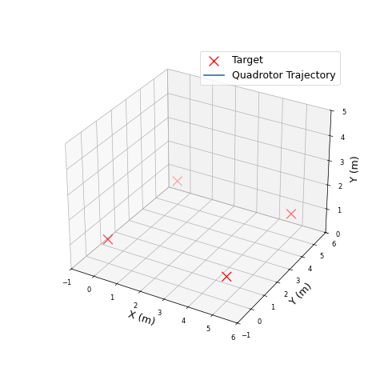

# PID Controller in Rust

A lightweight, generic, and robust PID (Proportional-Integral-Derivative)
controller for embedded and real-time applications.

## Why This PID?

- **Robust and Principled**

  - Significantly **improved** from the beginner's PID according to Brett
    Beauregard's guidelines [1] and the authoritative reference by Åström &
    Hägglund [2]
  - Extensively tested and even validated against Simulink’s built-in PID block
    --- the same behavior you know from your first controls course
  - Supports both stateful and **functionally pure** (stateless) PID
    computation, the latter enabling deterministic and **fully reproducible**

- **Lightweight and Dependency-Free**

  - Compatible with `#![no_std]` --- requiring only core float traits from
    `num_traits`
  - Abstracts over time using an `InstantLike` trait --- fully clock-agnostic

- **Real-World Ready**
  - Supports fine-grained control over PID activity: online (de)activation,
    (re)initialization, and pausing/resuming integration
  - First-order LPF for derivative term with predictable time constant behavior

## Quick Start

```rust
use pid_controller::{PidConfig, FuncPidController, PidContext};
use pid_controller::time::Micros;
use core::time::Duration;

let mut cfg = PidConfig::<f32>::default();
cfg.set_kp(1.0);
cfg.set_ki(0.5);
cfg.set_kd(0.1);
cfg.set_sample_time(Duration::from_micros(125)); // 8 kHz loop

let controller = FuncPidController::new(cfg);
let mut ctx = PidContext::<Micros, f32>::new_uninitialized();

let (output, new_ctx) = controller.compute(
    ctx,
    0.5,               // input
    1.0,               // setpoint
    Micros(micros()),  // assumes an Arduino-style `micros()` function
    None               // optional feedforward
);
```

## Examples

One of the most notable achievements of PID controllers in recent years has been
the stabilization and control of quadrotors. This is demonstrated here by a
simulated quadrotor navigating between waypoints using the PID controller from
this crate.

In this example, the quadrotor is modelled as a rigid body subjected to thrusts
delivered by the four propellers and torques proportional to those thrusts.
Motor speeds are not modelled. This quadrotor is controlled under a cascaded
architecture:

- The outer loop controller tracks position and velocity targets and computes a
  thrust and body rate setpoint. It is a faithful implementation of Mellinger
  and Kumar's geometric controller `[3].
- The inner loop controller tracks body rate setpoints and computes the motor
  thrusts. It consists of three PID controllers from this crate, one each for
  roll/pitch/yaw rate.



Run the example:

```sh
cargo run --example quadrotor_control --features nalgebra,std
```

Visualize the results:

```sh
python3 examples/plot_quadrotor_trajectory.py         # Generates static plot
python3 examples/plot_quadrotor_trajectory.py --animate show  # Live 3D animation
python3 examples/plot_quadrotor_trajectory.py --animate save  # Save to GIF
```

## Shoutouts

[`pid-rs`](https://crates.io/crates/pid) is a well-known and effective PID
controller crate for many standard use cases. This crate builds on that
foundation by offering not just more features and knobs and buttons, but also:

- **Simulink-compatible behavior** for quantitatively correct behavior
- **Stateless operation**, enabling pure functional control logic and paving the
  way to differentiable controllers

## References

1. Beauregard, B. _Improving the Beginner's PID_.
   [http://brettbeauregard.com/blog/2011/04/improving-the-beginners-pid-introduction/](http://brettbeauregard.com/blog/2011/04/improving-the-beginners-pid-introduction/)
2. Åström, K. J. "PID Controllers: Theory, Design, and Tuning". _The
   international society of measurement and control_, 1995.
3. D. Mellinger and V. Kumar, "Minimum snap trajectory generation and control
   for quadrotors," in _2011 IEEE international conference on robotics and
   automation_, IEEE, 2011, pp. 2520–2525

## License

MIT License. Copyright © 2025 Hs293Go
